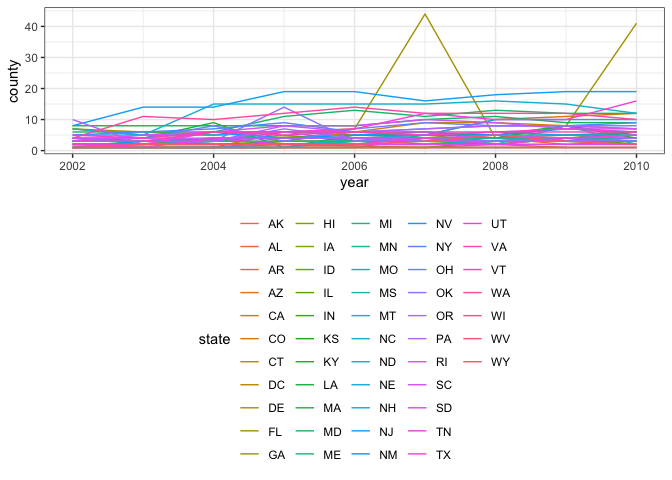
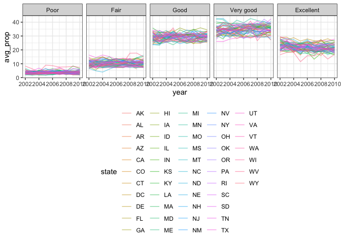
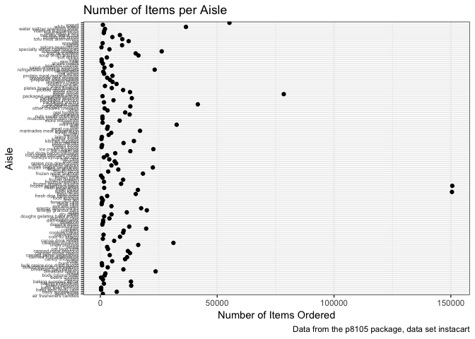

p8105\_hw3\_jv2629
================
Jaclyn Verity - jv2629
October 10, 2018

Setup the the document for success!
===================================

``` r
knitr::opts_chunk$set(echo = TRUE)
  fig.width = 10
  fig.asp = .6
  out.width = "90%"

library(tidyverse)
```

    ## ── Attaching packages ───────────────────────────────────────────────────── tidyverse 1.2.1 ──

    ## ✔ ggplot2 3.0.0     ✔ purrr   0.2.5
    ## ✔ tibble  1.4.2     ✔ dplyr   0.7.6
    ## ✔ tidyr   0.8.1     ✔ stringr 1.3.1
    ## ✔ readr   1.1.1     ✔ forcats 0.3.0

    ## ── Conflicts ──────────────────────────────────────────────────────── tidyverse_conflicts() ──
    ## ✖ dplyr::filter() masks stats::filter()
    ## ✖ dplyr::lag()    masks stats::lag()

``` r
library(ggridges)
```

    ## 
    ## Attaching package: 'ggridges'

    ## The following object is masked from 'package:ggplot2':
    ## 
    ##     scale_discrete_manual

``` r
library(knitr)
  
theme_set(theme_bw() + theme(legend.position = "bottom"))
```

Problem 1
=========

``` r
library(p8105.datasets)

beh_risk = brfss_smart2010 %>% 
  janitor::clean_names() %>% 
  filter(topic == "Overall Health") %>% 
 rename(state = locationabbr, county = locationdesc)

beh_risk = beh_risk %>% 
  mutate(response = factor(response, levels = c("Poor", "Fair", "Good", "Very good", "Excellent"))) %>% 
  arrange(desc(response))
```

**In 2002, which states were observed at 7 locations?**

``` r
beh_risk %>% 
  filter(year == 2002) %>%
  group_by(state) %>% 
  distinct(state, county) %>%  
  summarise(county = n())
```

    ## # A tibble: 49 x 2
    ##    state county
    ##    <chr>  <int>
    ##  1 AK         1
    ##  2 AL         1
    ##  3 AR         1
    ##  4 AZ         2
    ##  5 CA         1
    ##  6 CO         4
    ##  7 CT         7
    ##  8 DC         1
    ##  9 DE         3
    ## 10 FL         7
    ## # ... with 39 more rows

In 2002, North Carolina, Florida, and Connecticut were observed at 7 locations.

**Make a “spaghetti plot” that shows the number of locations in each state from 2002 to 2010.**

``` r
spag_plot = beh_risk %>% 
  group_by(year, state) %>% 
  distinct(county, .keep_all = TRUE) %>%  
  summarise(county = n()) 

ggplot(data = spag_plot, aes(x = year , y = county, group = state, color = state)) + geom_line()
```



**Make a table showing, for the years 2002, 2006, and 2010, the mean and standard deviation of the proportion of “Excellent” responses across locations in NY State.**

``` r
ny_excellent = beh_risk %>% 
  filter(year %in% c(2002, 2006, 2010)) %>%
  filter(state == "NY") %>% 
  filter(response == "Excellent") %>% 
  group_by(year) %>% 
  summarise(
    mean(data_value), sd(data_value))

kable(ny_excellent)
```

|  year|  mean(data\_value)|  sd(data\_value)|
|-----:|------------------:|----------------:|
|  2002|           24.04000|         4.486424|
|  2006|           22.53333|         4.000833|
|  2010|           22.70000|         3.567212|

**For each year and state, compute the average proportion in each response category (taking the average across locations in a state). Make a five-panel plot that shows, for each response category separately, the distribution of these state-level averages over time.**

``` r
resp5_plot = beh_risk %>% 
  select(year, state, county, response, data_value) %>% 
  group_by(year, state, response) %>% 
  summarise(
    avg_prop = mean(data_value)) 

ggplot(resp5_plot, aes(x = year, y = avg_prop, color = state)) + 
  geom_line(alpha = .5) +
  facet_grid(. ~ response)
```

    ## Warning: Removed 3 rows containing missing values (geom_path).



Problem 2
=========

**Describe the instacart data set.**

``` r
instacart
```

    ## # A tibble: 1,384,617 x 15
    ##    order_id product_id add_to_cart_ord… reordered user_id eval_set
    ##       <int>      <int>            <int>     <int>   <int> <chr>   
    ##  1        1      49302                1         1  112108 train   
    ##  2        1      11109                2         1  112108 train   
    ##  3        1      10246                3         0  112108 train   
    ##  4        1      49683                4         0  112108 train   
    ##  5        1      43633                5         1  112108 train   
    ##  6        1      13176                6         0  112108 train   
    ##  7        1      47209                7         0  112108 train   
    ##  8        1      22035                8         1  112108 train   
    ##  9       36      39612                1         0   79431 train   
    ## 10       36      19660                2         1   79431 train   
    ## # ... with 1,384,607 more rows, and 9 more variables: order_number <int>,
    ## #   order_dow <int>, order_hour_of_day <int>,
    ## #   days_since_prior_order <int>, product_name <chr>, aisle_id <int>,
    ## #   department_id <int>, aisle <chr>, department <chr>

The instacart data set appears to be data about online orders for groceries from a grocery chain. The data set is 15 columns by 1,384,617 rows. Each row represents a specific item ordered by a customer. The columns represent different information about each item ordered. Many of the items belong to the same order/cart/person as they have the same data values for order\_id, user\_id, order\_dow, order\_hour\_of\_the\_day, and days\_since\_prior\_order. Each item has a product\_id, a text name, what aisle it is found on, and in what department the product is registered under. For example, as the raw data stands now, row 6 contains product\_id 13176, A Bag of Organic Bananas, located in aisle 24 - fresh fruits, department 4 - produce. The data set also contains data on the user's habits/process in ordering: how often the user orders this item, how many orders they have placed, the order in which the item was added to the cart, and the time of week/day the order was placed.

**How many aisles are there, and which aisles are the most items ordered from?**

``` r
instacart %>% 
  distinct(aisle_id) %>% 
  arrange(desc(aisle_id))
```

    ## # A tibble: 134 x 1
    ##    aisle_id
    ##       <int>
    ##  1      134
    ##  2      133
    ##  3      132
    ##  4      131
    ##  5      130
    ##  6      129
    ##  7      128
    ##  8      127
    ##  9      126
    ## 10      125
    ## # ... with 124 more rows

``` r
instacart %>% 
  count(aisle_id) %>% 
  arrange(desc(n))
```

    ## # A tibble: 134 x 2
    ##    aisle_id      n
    ##       <int>  <int>
    ##  1       83 150609
    ##  2       24 150473
    ##  3      123  78493
    ##  4      120  55240
    ##  5       21  41699
    ##  6      115  36617
    ##  7       84  32644
    ##  8      107  31269
    ##  9       91  26240
    ## 10      112  23635
    ## # ... with 124 more rows

``` r
instacart %>% 
  filter(aisle_id %in% c(83, 24, 123))
```

    ## # A tibble: 379,575 x 15
    ##    order_id product_id add_to_cart_ord… reordered user_id eval_set
    ##       <int>      <int>            <int>     <int>   <int> <chr>   
    ##  1        1      10246                3         0  112108 train   
    ##  2        1      49683                4         0  112108 train   
    ##  3        1      13176                6         0  112108 train   
    ##  4        1      47209                7         0  112108 train   
    ##  5       36      43086                4         1   79431 train   
    ##  6       36      48679                7         1   79431 train   
    ##  7       36      46979                8         1   79431 train   
    ##  8       38      18159                2         0   42756 train   
    ##  9       38      21616                4         1   42756 train   
    ## 10       38      23622                5         0   42756 train   
    ## # ... with 379,565 more rows, and 9 more variables: order_number <int>,
    ## #   order_dow <int>, order_hour_of_day <int>,
    ## #   days_since_prior_order <int>, product_name <chr>, aisle_id <int>,
    ## #   department_id <int>, aisle <chr>, department <chr>

There are 134 aisles. The aisles with the most orders are aisles 83 - fresh vegetables, 24 - fresh fruits, and 123 - packaged vegetables fruits with 150,609, 150,473, and 78,493 items ordered, respectively.

**Make a plot that shows the number of items ordered in each aisle. Order aisles sensibly, and organize your plot so others can read it.**

``` r
aisle_plot = instacart %>%
  group_by(aisle) %>% 
  summarise(n = n()) %>% 
  arrange(n)

ggplot(aisle_plot, aes(x = n, y = aisle)) + 
  geom_point() +
  labs(
    title = "Number of Items per Aisle",
    x = "Number of Items Ordered",
    y = "Aisle",
    caption = "Data from the p8105 package, data set instacart"
  ) + theme(axis.text.y = element_text(size = 5, vjust = 1))
```



**Make a table showing the most popular item in each of the aisles “baking ingredients”, “dog food care”, and “packaged vegetables fruits”.**

``` r
popular = instacart %>% 
  select(aisle, product_id, product_name) %>% 
  filter(aisle %in% c("baking ingredients", "dog food care", "packaged vegetables fruits")) %>% 
  group_by(aisle) %>% 
  summarise(most_pop = max(product_name), na.rm = TRUE)

kable(popular)
```

| aisle                      | most\_pop                       | na.rm |
|:---------------------------|:--------------------------------|:------|
| baking ingredients         | Zero Calorie Sweetener          | TRUE  |
| dog food care              | Zero Grain Turkey Dog Food      | TRUE  |
| packaged vegetables fruits | Zucchini Squash, Baby Courgette | TRUE  |

**Make a table showing the mean hour of the day at which Pink Lady Apples and Coffee Ice Cream are ordered on each day of the week; format this table for human readers (i.e. produce a 2 x 7 table).**

``` r
mean_hour = instacart %>% 
  filter(product_name %in% c("Pink Lady Apples", "Coffee Ice Cream")) %>% 
  group_by(product_name, order_dow) %>% 
  summarise(mean_time = mean(order_hour_of_day)) %>% 
  spread(key = order_dow, value = mean_time ) %>% 
  rename(Saturday = "0",
         Sunday = "1",
         Monday = "2",
         Tuesday = "3",
         Wednesday = "4",
         Thursday = "5",
         Friday = "6")

kable(mean_hour)
```

| product\_name    |  Saturday|    Sunday|    Monday|   Tuesday|  Wednesday|  Thursday|    Friday|
|:-----------------|---------:|---------:|---------:|---------:|----------:|---------:|---------:|
| Coffee Ice Cream |  13.77419|  14.31579|  15.38095|  15.31818|   15.21739|  12.26316|  13.83333|
| Pink Lady Apples |  13.44118|  11.36000|  11.70213|  14.25000|   11.55172|  12.78431|  11.93750|

Problem 3
=========
